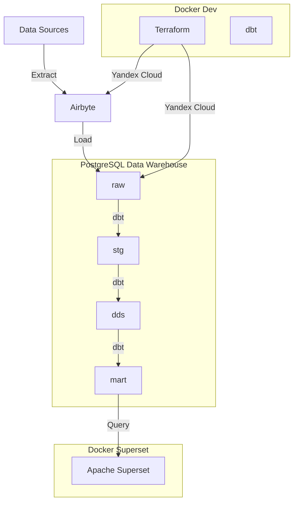
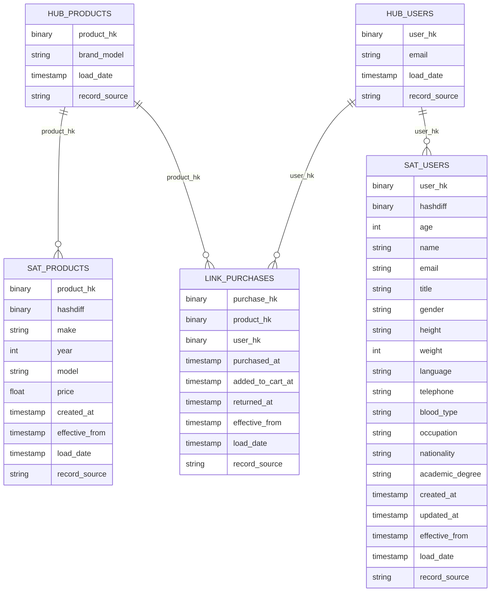
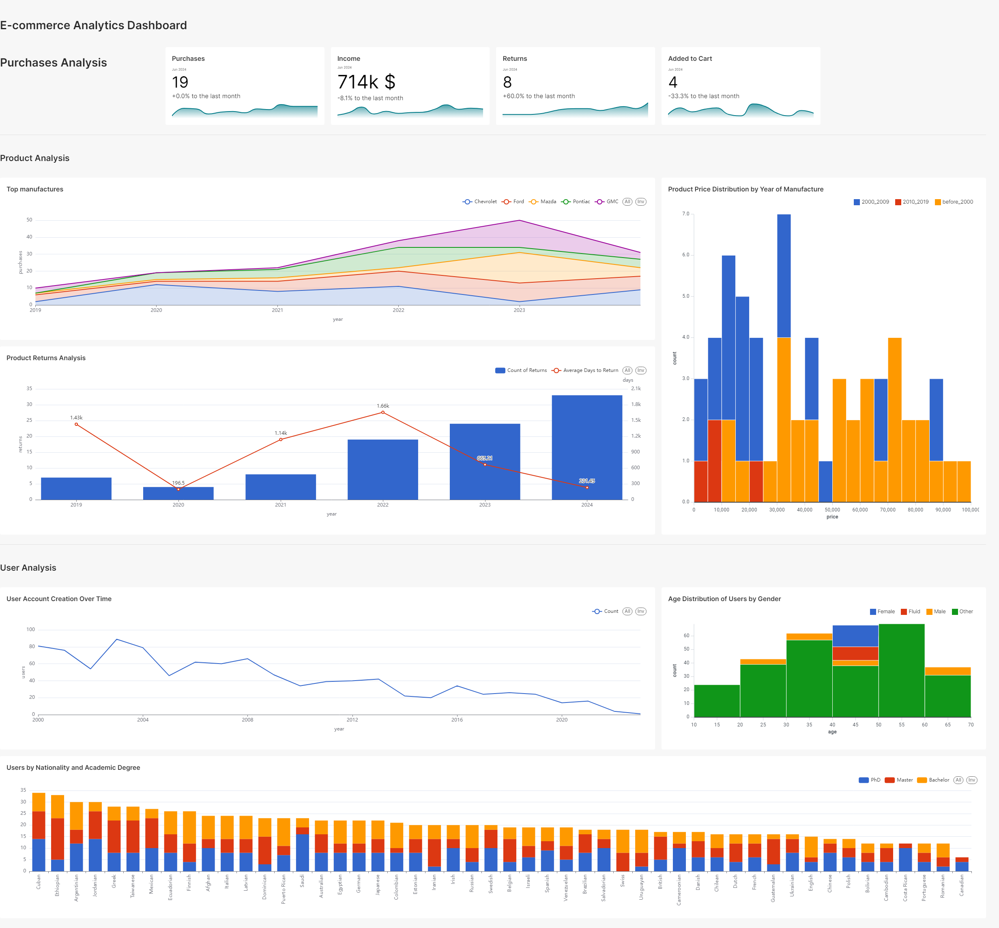

# Cloud Data Vault with dbt and Airbyte

## Project Overview
The "Cloud Data Vault with dbt and Airbyte" project is a comprehensive data management solution for integrating, transforming, and orchestrating ETL processes using dbt (Data Build Tool) and Airbyte. The project aims to create a cloud-based data vault, ensuring efficient data workflows.

This project is a part of the course **[Data Warehouse Analyst (OTUS)](https://otus.ru/lessons/dwh/)**. It demonstrates the integration and automation of data workflows using dbt (Data Build Tool) and Airbyte, along with infrastructure management via Terraform and data visualization through Apache Superset.

## Definition of Done
* Successful integration of data sources using Airbyte.
* Data transformation and modeling in dbt.
* Automated deployment of infrastructure using Terraform.
* Visualization of data in Apache Superset dashboards.
* Presentation of actionable insights from the data.

## Business Value

* Enhanced data-driven decision-making.
* Improved data accessibility and usability.
* Automated ETL processes to save time and reduce errors.

## Key Components

1. Terraform:

   - Tool for automating and managing infrastructure.
   - Used to deploy the cloud infrastructure required for the project.

2. Airbyte:
   - Data integration platform for extracting and loading data from various sources.
   - Supports multiple connectors for popular data sources.

3. dbt (Data Build Tool):
   - Handles data transformation and modeling in the data warehouse utilizing [AutomateDV](https://automate-dv.readthedocs.io/en/latest/) package.
   - Integrates with Airbyte for workflow automation.

4. Apache Superset:
   - Data visualization tool.
   - Used to create dashboards and reports based on the data transformed by dbt and Airbyte.



## Classification of Data Sources, Load Frequency, Data Formats, and Structure
* Data Sources: [Fake e-commerce-like data](https://docs.airbyte.com/integrations/sources/faker).
* Load Frequency: Hourly.
* Source Data Formats: JSON.
* Data Structure: Data Vault.

## Data Warehouse



## Deployment Instructions

1. Fork this repository.
2. Copy template file `.env.template` to `.env` file and add credentials.
3. Start Docker containers.
   ```sh 
   docker-compose up -d
   ```
4. Enter into the `infrastructure` container.
   ```sh
   docker exec -it infrastructure bash
   ```
5. Configure yc CLI.
   ```sh
   yc init
   ```
6. Set environment variables.
   ```sh
   export YC_TOKEN=$(yc iam create-token)
   export YC_CLOUD_ID=$(yc config get cloud-id)
   export YC_FOLDER_ID=$(yc config get folder-id)
   export TF_VAR_folder_id=$(yc config get folder-id)
   export $(xargs < .env)
   ```
7. Configure YC Terraform provider.
   ```sh 
   cd terraform/
   cp terraformrc ~/.terraformrc
   ```
8. Run Terraform.
   ```sh 
   terraform init
   terraform validate
   terraform fmt
   terraform plan
   terraform apply
   ```
   By the end of the deployment you will see the output you will need in a moment.
    ```
    Outputs:
    
    postgresql_cluster_id = "<id>"
    postgresql_dbname = "dbname"                     # from .env
    postgresql_host = "*.mdb.yandexcloud.net"
    postgresql_user = "user"                         # from .env
    yandex_compute_instance_nat_ip_address = "<ip>"
    yandex_iam_service_account_static_access_key = "<key>"
    yandex_iam_service_account_static_secret_key = <sensitive>
    ```
9. Open and log into Airbyte instance at `{yandex_compute_instance_nat_ip_address}:8000` with credentials:
   ```
   login: airbyte
   password: password
   ```
10. Create source [Faker](https://docs.airbyte.com/integrations/sources/faker).
11. Create destination [PostgreSQL](https://docs.airbyte.com/integrations/destinations/postgres) with credentials:
    - **host**: {postgresql_host}
    - **port**: 6432
    - **username**: {postgresql_user}
    - **password**: {postgresql_password}  # from .env
    - **schema**: public
    - **database**: {postgresql_dbname}
12. Set up connection in Airbyte:
    - Choose `Replication frequency`.
    - Change `Destination Namespace` to `Custom`.
    - Change `Namespace Custom Format` to `raw`.
    - Change `Sync mode` to `Incremental | Append`.
    - Click `Set up connection`.
13. Set `DBT_HOST` environment variable, move to dbt folder and check the connection.
    ```sh 
    export DBT_HOST=$(terraform output -raw postgresql_host)
    cd ../dbt
    dbt debug
    ```
14. Install dbt packages:
    ```sh 
    dbt deps
    ```
15. Run dbt models:
    ```sh
    dbt run
    ```
16. Open Superset at http://localhost:8088/.

## Dashboard Example


## Key Insights and Conclusions

### Purchases Analysis for June 2024
* Total Purchases: There were 19 purchases made, it didn't change compared to the last month.
* Income: The total income is $714K, which shows an 8.1% decrease from the previous month.
* Returns: There were 8 returns, representing a 60% increase from the last month.
* Items Added to Cart: Only 4 items were added to the cart, indicating a 33.3% decrease from the previous month.

### Product Analysis
1. Top Manufacturers:
   * The US manufacturers dominate the top 5.

2. Product Returns Analysis:
   * In 2024 the count of returns significantly increased.
   * Lately customers return purchases much sooner.

3. Product Price Distribution by Year of Manufacture:
   * Products manufactured between 2000-2009 are mostly cheaper.
   * Products manufactured before 2000 have both cheap and expensive models (likely related to the condition and retro attitude).

### User Analysis
1. User Account Creation Over Time:
   - There is a general decline in the creation of user accounts over the years, with some peaks indicating occasional surges in new users.

2. Age Distribution of Users by Gender:
   * Users are primarily in the age ranges of 40-60.
   * Users prefer not to disclose their gender.
   * Perhaps, some issue allowing users choosing 'Fluid' gender.

3. Users by Nationality and Academic Degree:
   * Our products are more in demand for Latin America and Africa.
   * Most of our customers have M.Sc., PhD degrees.

## Recommendations
* **Address Returns:** Investigate the reasons behind the high return rate, especially for products from specific years of manufacture, and implement quality control measures.
* **Enhance User Acquisition:** Develop targeted campaigns to attract new users and re-engage existing ones, focusing on the peaks in user account creation.
* **Leverage Demographic Insights:** Tailor marketing and product offerings to the well-educated user base, potentially offering premium or specialized products.
